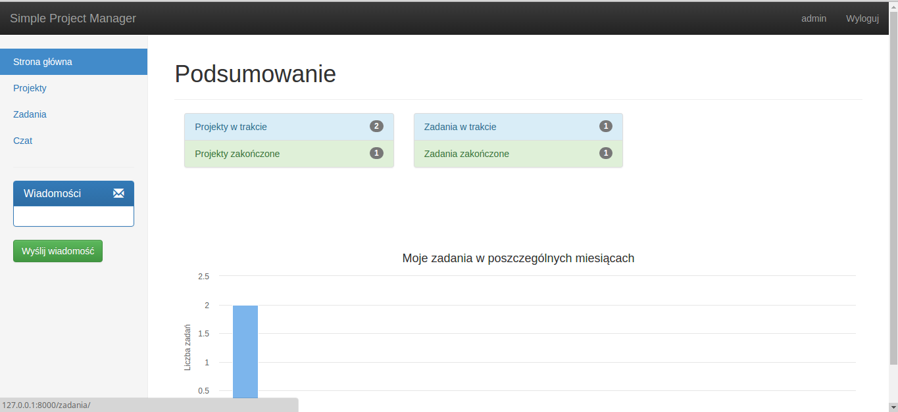
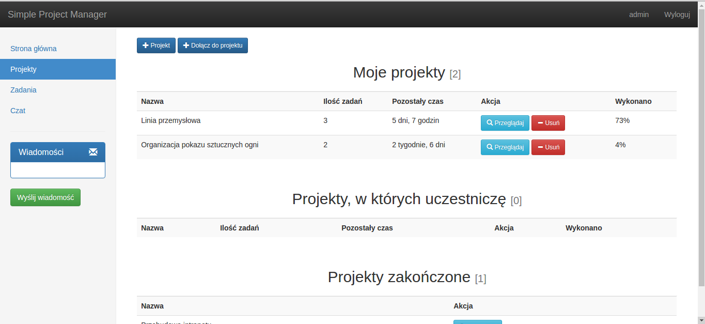
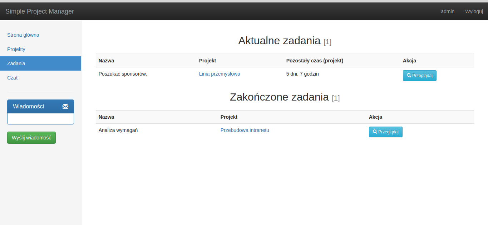
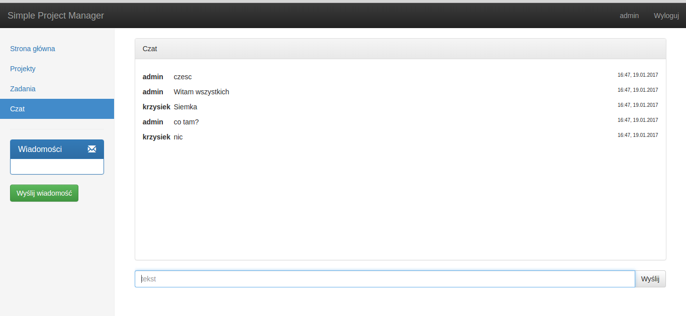
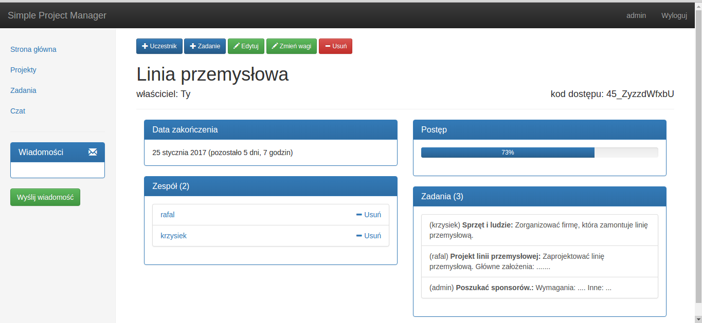
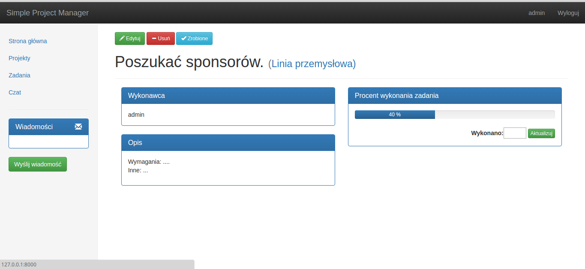

# Simple-Project-Manager

## Features
- add/edit/remove projects
- add/remove memebers to project
- add/edit/remove tasks for project
- logging
- live chat with all users
- private messaging
- some chart withs statistics
- admin panel
- progress of project is based on percent progress of tasks (every task have weight, owner must set this weights)

## Important information
- user admin -> password: klarnet1
- user krzysiek -> password: password123
- user rafal -> password: password123
- registration is doing by admin in Admin Panel (you have to copy encoded password from other user and set it to new user), then new user will change it himself in his profile

## How to use it?
- create virtual environment for Python3: virtualenv -p python3 venv
- download this project: git clone https://github.com/vizarch/Simple-Project-Manager.git
- install requirements: Requirements.txt is for help, don't install from it !!
  - source venv/bin/active
  - pip install Django==1.10.3
  - pip install django-bootstrap-form
  - pip install django-directmessages
  - pip install chartkick
  - pip install daphne==0.15.0 (!!! important, 1.0.2 don't work - I don't know why)
  - pip install channels==0.17.3 (!!! important, 1.0.2 don't work - I don't know why)
  - rest of requirements will be installed automatically with others
- python manager.py runserver

## If you would like to find out more. Please ask me on: (without spaces)
krzysztof . luczak 99 @ gmail . com 

## Screenshots

